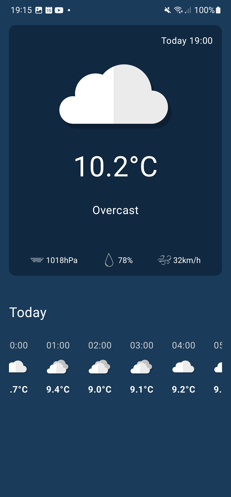
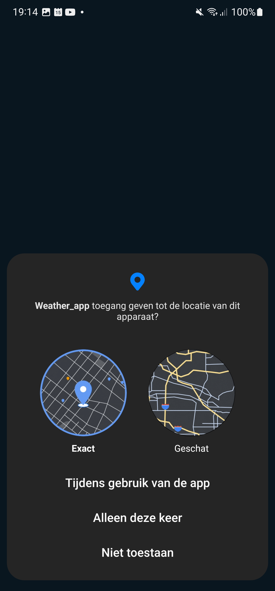
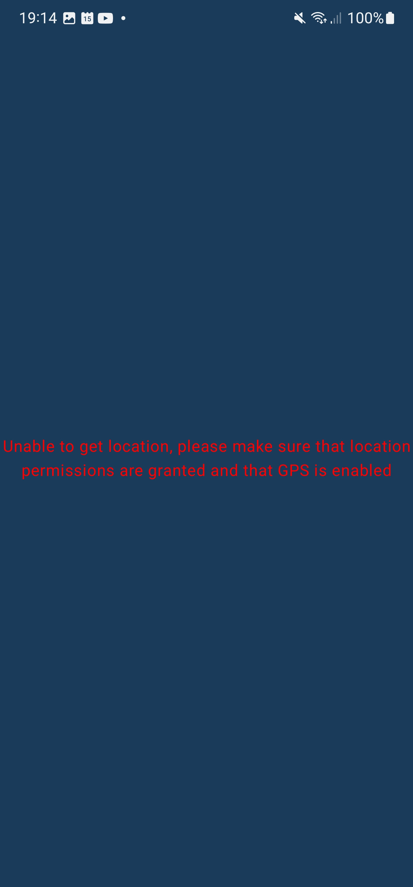
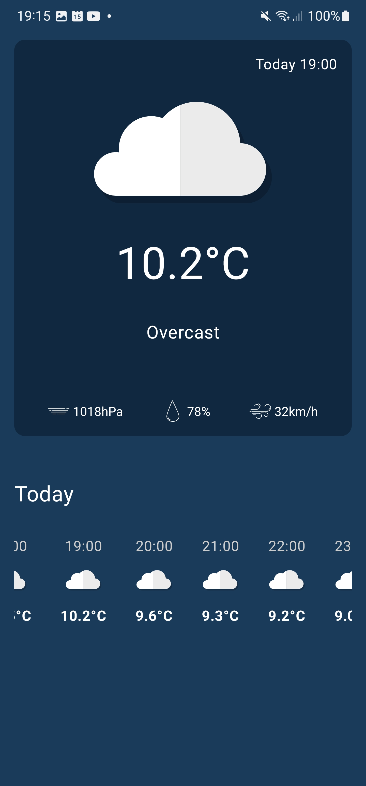

# Weather Report Application

This project focuses on building a weather app for Android, aimed at providing practical experience with Java on a mobile platform. The app's primary functionality is to display the daily average temperature forecast for the upcoming week (i.e., 7 upcoming days) from the day the app runs.

# Weather App with Open-Meteo API and Current Location

Experience the Weather app, a straightforward and user-friendly tool designed to showcase the current weather conditions based on your precise location. Through seamless integration with the Open-Meteo API, this app provides real-time updates on temperature, humidity, wind speed, and overall weather conditions. Let the Weather app keep you informed and prepared, ensuring you never find yourself unexpectedly caught in the rain!

This app was partailly created to hone my skills in Java and Kotlin to better understand app structure, user interfaces, backend API pulling and parsing as well as app building.

## Features
- Open-Meteo API integration for current weather conditions
- Current location for precise weather information
- Displays current temperature, humidity, wind speed, and weather conditions and changes the corrseponding image associated with each respective weather and time
- Utilizes JSON fundamentals to parae raw data and display it in a disgestable format for the user

   

